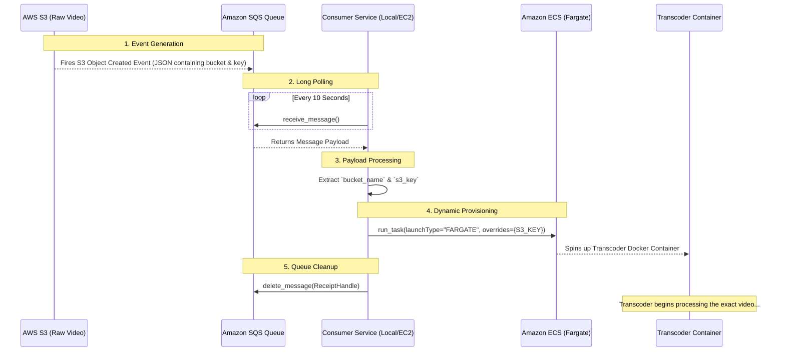

# Video Streaming App - Consumer Service

Welcome to the Consumer Service of the Video Streaming App. This microservice acts as the crucial bridge between raw video uploads on AWS S3 and the heavy-lifting Transcoder Service. It continuously polls an Amazon SQS queue for new upload events and dynamically provisions compute resources on AWS ECS.

---

## 📂 Project Structure

This service is intentionally lean and focused:

```
Consumer Service/
│
├── .env                      # Environment variables (excluded from version control)
├── .env.example              # Template for required environment variables
├── .gitignore                # Git ignore rules
├── main.py                   # The core execution loop (SQS Poller & ECS Spawner)
├── pyproject.toml / uv.lock  # Dependency management metadata
├── requirement.txt           # Python package dependencies
└── secret_keys.py            # Environment logic using pydantic-settings
```

---

## 🛠️ Packages Used

Here are the primary libraries powering this microservice:

*   **`boto3`**: The AWS SDK for Python. Used extensively to poll Amazon SQS (`sqs_client.receive_message`) and to programmatically launch containers on Amazon ECS (`ecs_client.run_task`).
*   **`pydantic-settings`**: Provides structured and validated environment variable management based on Pydantic models.
*   **`python-dotenv`**: Used to load environment variables securely from the local `.env` file into the application context.

---

## 🧩 Main Functions & Logic

### `main.py` -> `poll_sqs()`
This is the single core function of the service. It essentially acts as an infinite event loop with the following responsibilities:

1.  **Polling SQS**: It continuously polls `AWS_SQS_VIDEO_PROCESSING_QUEUE_URL` for new messages (Long polling with `WaitTimeSeconds=10`).
2.  **Message Unwrapping**: Safely handles different S3 Event Notification structures (e.g., direct SQS vs. EventBridge/SNS unwrapping). Ignores `s3:TestEvent` pings automatically.
3.  **Data Extraction**: Once a valid file upload event is found, it extracts the target `bucket_name` and the specific `s3_key` (URL Unquoted).
4.  **Launching ECS Fargate Tasks**: It communicates with ECS to spin up a serverless Docker container instance of the **Transcoder Service**.
    *   It dynamically injects the `S3_BUCKET_NAME` and `S3_KEY` into the Transcoder container through **`containerOverrides`**.
    *   It defines the networking map (`awsvpcConfiguration`) including subnets, auto-assigning public IP (to pull images/access internet), and security groups.
5.  **Clean up**: Upon successful ECS task launch, it deletes the message from the SQS queue using the `ReceiptHandle` to prevent duplicate processing.

---

## 🔄 Architecture & Infrastructure Flow Diagram



---

## ⚖️ Architecture Decisions & Trade-offs

| Decision | Why we did it | Trade-off Made |
| :--- | :--- | :--- |
| **Separating Consumer from Backend API** | Fast decoupling. The FastAPI backend is never blocked waiting for SQS or dealing with AWS ECS configurations. It just returns URLs and moves on. | Introduces another microservice to maintain, monitor, and deploy. Needs its own `.env` and environment bindings. |
| **Serverless ECS (Fargate)** | Processing 4K/1080p video is incredibly CPU intensive. Standard EC2 instances could crash under load. Fargate provisions a fresh isolated environment per-video automatically, ensuring flawless parallel processing. | Fargate execution time is technically more expensive per minute than running a fixed EC2 instance 24/7 if traffic volume is very high. Fargate tasks also have a cold start time (seconds to boot the container). |
| **Long Polling (`WaitTimeSeconds=10`)** | Reduces empty reads and significantly lowers the number of API calls made to AWS SQS, saving money and AWS rate-limits. | Slight latency (max 10s) before processing kicks off vs WebSockets. |

---

## 🌩️ Amazon Services Utilized

*   **Amazon SQS**: Acts as the robust buffer queue. Guarantees message delivery and handles the fan-out from S3 cleanly.
*   **Amazon ECS (Elastic Container Service)**: The orchestrator managing the Transcoder containers.
*   **AWS Fargate**: The serverless compute engine for ECS. Removes the need to provision or manage EC2 instances for the transcoding payload.
*   **(Trigger Source) Amazon S3**: While not directly modified here, the entire logic cascade relies on S3 firing Event Notifications payload configurations via AWS EventBridge/SNS to SQS.

---

## 🚀 Future Improvements for Scaling

1.  **Dead Letter Queue (DLQ) Fallback**: Ensure SQS is configured with a DLQ. If `main.py` crashes on a weird JSON payload 3 times, it should seamlessly send the message to the DLQ for manual inspection rather than infinitely error-looping.
2.  **Concurrency / Batching**: Currently, `MaxNumberOfMessages=1`. As traffic scales, this could be increased to `10`, launching multiple ECS task variants asynchronously using `asyncio` or ThreadPoolExecutor to save local execution time.
3.  **Deploy as AWS Lambda**: This specific continuous polling python script is an excellent candidate to be converted entirely into an **AWS Lambda function** triggered directly by the SQS queue, essentially removing the need to host this specific "Consumer Service" 24/7 on an EC2 box or local machine.
4.  **Observability & Telemetry**: Integrate AWS CloudWatch logging or DataDog into `main.py` to graph exactly how many messages are entering/exiting per minute.
