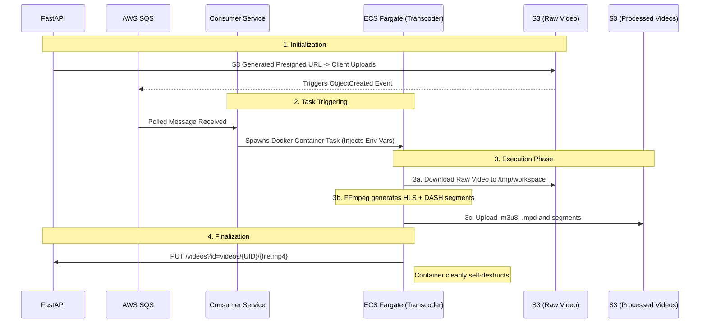

# Video Streaming App - Transcoder Service

Welcome to the Transcoder Service of the Video Streaming App. This microservice is containerized using **Docker** and runs as a serverless task on **AWS ECS (Fargate)**. Its sole purpose is to download a raw video from S3, transcode it into multiple adaptive bitrates (360p, 720p, 1080p) for HLS and DASH streaming protocols using `ffmpeg`, and upload the final segments back to S3.

---

## 📂 Project Structure

This service is fully containerized and executes as a single-run script:

```
Transcoder Service/
│
├── .env                      # Local environment variables
├── .env.example              # Template for required environment variables
├── .gitignore                # Git ignore rules
├── Dockerfile                # Instructions to build the container image (installs ffmpeg)
├── main.py                   # The core Execution Script that orchestrates the transcoding
├── pyproject.toml            # Project metadata
├── requirements.txt          # Python package dependencies
└── secrets_keys.py           # Environment logic using pydantic-settings
```

---

## 🛠️ Packages Used

Here are the primary libraries powering this service:

*   **`ffmpeg`** (System Level): Installed via the `Dockerfile`. Provides the core engine for encoding/transcoding video to HLS and DASH formats.
*   **`boto3`**: Amazon SDK used to securely download the raw video from S3 and recursively upload the output segments back to the S3 processed bucket.
*   **`requests`**: Used uniquely at the end of the pipeline to trigger a webhook `PUT` request to the backend API (`BACKEND_URL/videos`) to mark the video as `COMPLETED`.
*   **`pydantic-settings`**: Manages environment variables gracefully.

---

## 🧩 Main Functions & Logic

The entire logic is wrapped inside the `VideoTranscoder` class found in `main.py`.

### 1. `process_video()`
This represents the orchestrator or "Main function" of the service.
*   Sets up the temporary workspace inside the Docker container (`/tmp/workspace`).
*   Sequentially runs `download_video`, `transcode_video`, `upload_files`, and `update_video`.
*   Finally, cleans up all files using `shutil.rmtree()` to prevent container memory bloat or out-of-storage exceptions.

### 2. `transcode_video(input_path, output_dir)`
The heaviest lifting part of the application. It invokes `ffmpeg` natively using Python's `subprocess` module.
*   Takes the raw MP4 video and splits it into 3 simultaneous processing streams using `filter_complex`.
*   **360p (1000k b/s)**, **720p (4000k b/s)**, **1080p (8000k b/s)**.
*   Encodes video sequences in `libx264` maintaining a continuous GOP size (`-g 48`) which is vital for smooth adaptive bitrate streaming.
*   Outputs standard HLS streams with `playlist.m3u8` and `segment_000.ts` formats.
*   Outputs DASH streams with `manifest.mpd` and `.m4s` formats.

### 3. `upload_files()` & `update_video()`
*   **upload_files**: Walks over the local `/tmp/workspace/output` folder and maps every file to S3 (`S3_PROCESSED_VIDEOS_BUCKET`). It injects `{prefix}/` to ensure files stay tightly enclosed in their parent video UUID paths. It makes sure `ACL` is explicitly set to `public-read`.
*   **update_video**: Shoots a completion ping payload safely back to the FastAPI backend to notify clients.

---

## 🔄 The Full Streaming Pipeline Flow Diagram

This diagram displays the lifecycle of the video starting from the backend, moving through the Consumer, the Transcoder, and finally to playback.



---

## ⚖️ Architecture Decisions & Trade-offs

| Decision | Why we did it | Trade-off Made |
| :--- | :--- | :--- |
| **Baking FFmpeg into a Docker Container** | FFmpeg is notoriously sticky to install perfectly across operating systems (Mac, Linux, Windows). Creating an explicit `Dockerfile` guarantees identical execution environments everywhere. | Image size increases dramatically compared to a basic Python script. AWS ECR storage and pull times go up slightly. |
| **Fast / Veryfast Preset for FFmpeg** | Using `-preset veryfast` vastly accelerates video encoding for near real-time live video publishing feedback. | Trades compression density for speed. The output videos might be slightly larger file sizes compared to using a `slow` preset. |
| **Containerizing as a Fargate Task** | Allows infinite scale. If 100 users upload a video simultaneously, AWS spins up 100 separate lightweight worker containers. | Cold start penalties (taking ~10 - 20 seconds to boot the container image) apply. |

---

## 🌩️ Amazon Services Utilized

*   **AWS Elastic Container Service (ECS)**: Hosts the Docker image natively.
*   **AWS Fargate**: The underlying execution network driving ECS, meaning we do not maintain EC2 instances. 
*   **Amazon S3**: Leveraged for persistent storage. Serves both as the raw file puller (`S3_BUCKET_NAME`) and the final destination output (`S3_PROCESSED_VIDEOS_BUCKET`).
*   **Amazon ECR** (Implicit): The Elastic Container Registry stores the specific Docker Image built from the `Dockerfile` in this directory so Fargate can fetch it.

---

## 🚀 Future Improvements for Scaling

1.  **Hardware Acceleration**: Switch the base Docker image from a standard slim linux to an **Nvidia GPU base image**. FFmpeg's `h264_nvenc` codec cuts transcoding times by 500% to 1000% using dedicated hardware vs CPU encoding.
2.  **Watermarking & Compression Overlays**: Update the `filter_complex` mechanism dynamically to overlay a custom watermark based on user input, or auto-crop videos into mobile standards (9:16 portrait) based on dynamic ECS variables triggered by the Consumer.
3.  **MediaConvert Alternative**: Evaluate totally replacing this custom Transcoder codebase with `AWS Elemental MediaConvert`. AWS MediaConvert abstracts all this FFmpeg logic effortlessly, although customizing complex commands comes at a higher dollar processing premium. 
