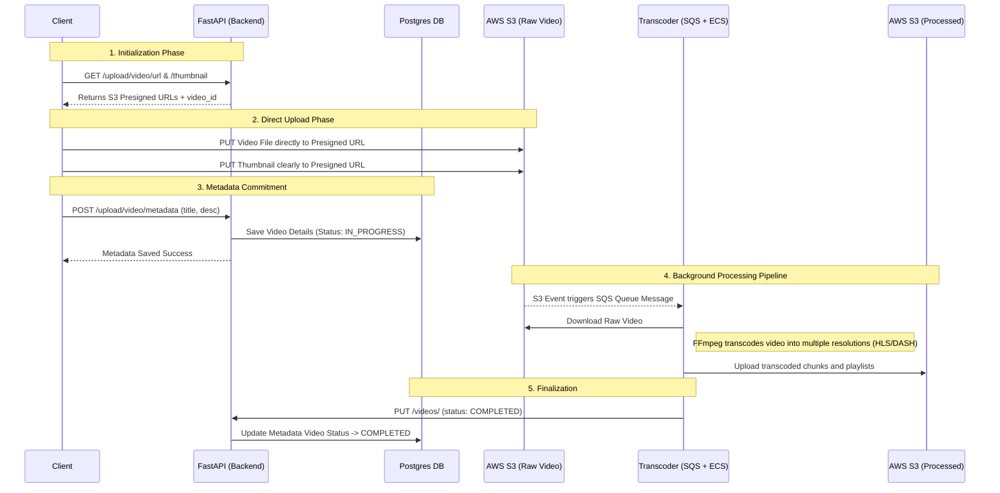

# Video Streaming App - Backend

Welcome to the backend service of the Video Streaming App. This service is built using **FastAPI** and is responsible for managing user authentication, video metadata, securely handling video uploads, and retrieving video feeds.

---

## 📂 Project Structure

The codebase is organized modularly to maintain separation of concerns:

```
backend/
│
├── db/                       # Database Configurations & Models
│   ├── base.py               # SQLAlchemy declarative base
│   ├── db.py                 # PostgreSQL connection & engine setup
│   ├── redis_db.py           # Redis client initialization for caching
│   ├── middleware/           # Middlewares (e.g., auth_middleware to protect routes)
│   └── models/               # SQLAlchemy ORM Models (users, videos, Enums)
│
├── helpers/                  # Utilities & Helpers
│   └── auth_helper.py        # Cognito Secret Hash generation & auth utils
│
├── pydantic_models/          # Pydantic Schemas for validation
│   ├── auth_model.py         # Schemas for Login, Signup, Confirm requests
│   └── upload_model.py       # Schemas for Video Metadata DB entries
│
├── routes/                   # API Endpoints / Routers
│   ├── auth.py               # Cognito integration: signup, login, refresh tokens
│   ├── upload.py             # S3 Pre-signed URLs for client-side direct uploads
│   └── video.py              # Retrieving videos with Redis Cache-Aside pattern
│
├── main.py                   # FastAPI Application entry point / CORS setup
├── secret_keys.py            # Environment logic using pydantic-settings
└── requirement.txt           # Python package dependencies
```

---

## 🛠️ Packages Used

Here are the primary libraries powering this backend:

*   **`fastapi` & `uvicorn`**: High-performance asynchronous web framework and its ASGI server.
*   **`boto3`**: AWS SDK. Used to interact with **Amazon Cognito** (authentication) and **Amazon S3** (generating pre-signed URLs).
*   **`sqlalchemy` & `psycopg2-binary`**: ORM mapping and the Postgres database adapter for managing user and video metadata synchronously.
*   **`redis`**: In-memory data wrapper used to implement the Cache-Aside pattern in video retrieval endpoints, boosting read performance.
*   **`pydantic-settings` & `python-dotenv`**: Environment variable validation and sensitive key management.

---

## 🧩 Main Functions & Endpoints

### 1. `routes/auth.py`
Integrates with AWS Cognito to offload identity management.
*   `POST /auth/signup`: Validates payload and triggers Cognito signup. Creates a local DB user mapped via the `cognito_sub`.
*   `POST /auth/login`: Authenticates with Cognito using `USER_PASSWORD_AUTH` flow and securely sets `access_token` and `refresh_token` as HTTP-only cookies.
*   `POST /auth/confirm-user`: Verifies user with a Cognito confirmation code (OTP).
*   `POST /auth/refresh-token`: Requests a fresh access token seamlessly using the stored refresh cookie.

### 2. `routes/upload.py`
Handles the crucial first steps of the video lifecycle.
*   `GET /upload/video/url`: Generates a unique `video_id` (UUID format) and returns an **S3 Pre-signed URL** for uploading the raw `mp4` video directly.
*   `GET /upload/video/url/thumbnail`: Returns an **S3 Pre-signed URL** allowing the client to upload the poster/thumbnail.
*   `POST /upload/video/metadata`: After successful S3 uploads, the client sends metadata (Title, Description, Visibility) here to be persisted in Postgres as `IN_PROGRESS`.

### 3. `routes/video.py`
Handles video distribution and rendering capabilities.
*   `GET /videos/all`: Fetches all `COMPLETED` and `PUBLIC` videos. Results are cached heavily in Redis (`videos:all:public`).
*   `GET /videos/{video_id}`: Fetches individual video metadata using the **Cache-Aside** strategy.
*   `PUT /videos/`: (Internal/Consumer) Updates a video's `is_processing` status to `COMPLETED` once the Transcoder Service finishes processing.

---

## 🔄 The Architecture & Upload Flow Diagram

Instead of routing heavy video files through the FastAPI server (which creates severe bottlenecks), the client offloads the heavy lifting directly to AWS S3. Once uploaded, background processes take over the transcoding magic.

### Client Upload & Video Processing Pipeline



---

## ⚖️ Architecture Decisions & Trade-offs

| Decision | Why we did it | Trade-off Made |
| :--- | :--- | :--- |
| **Direct S3 Uploads (Pre-signed URLs)** | Prevents the FastAPI server from being blocked by massive MB/GB video uploads, saving computing costs and preventing timeouts. | The client has slightly more complex logic, and we must trust the client to tell us when an upload succeeds (via `/metadata` route) to track state. |
| **AWS Cognito for Auth** | Offloads complex identity, hashing, and token renewal logic. Super scalable and highly secure out-of-the-box. | Vendor lock-in to AWS. Local testing becomes somewhat annoying as it strictly requires internet and live AWS resources. |
| **Cache-Aside Pattern (Redis)** | The `video` fetching APIs are read-heavy. Redis drastically reduces DB load and serves the feed to clients basically instantly. | Potential for stale data (e.g., if a user changes the title, the cache must invalidate correctly, otherwise the old title shows for up to 5 minutes). |

---

## 🔑 Environment Variables

To run this backend locally, you will need to set up your environment variables. 
A template `.env.example` has been provided in the repository. 
Copy it to `.env` and fill in your actual credentials:

```bash
cp .env.example .env
```

---

## 🌩️ Amazon Services Utilized

*   **Amazon Cognito**: Used for securing user endpoints, managing User Pools, and obtaining Auth JWT Tokens.
*   **Amazon S3**: Used as robust blob storage. Has two main components: `AWS_RAW_VIDEO_BUCKET` for initial uploads and a separate mechanism/bucket for holding final transcoded videos and thumbnails.
*   **Amazon SQS / EventBridge** (Background): Captures S3 Object creation events to feed into the consumer queue.
*   **Amazon ECS** (Background): Hosts the detached Dockerized Python Transcoder Service that executes FFmpeg work securely and independently.

---

## 🚀 Future Improvements for Scaling

1.  **CloudFront CDN Integration**: Wrapping S3 buckets with CloudFront CDN to serve video chunks globally with massive caching. This prevents direct S3 bandwidth pricing and significantly speeds up client video buffering loops.
2.  **WebSockets or Server-Sent Events (SSE)**: Instead of the client polling or blindly waiting, the backend can emit a WebSocket event out to the specific user's app the exact moment the Transcoder fires `PUT /videos/` signalling the video is ready to watch.
3.  **Queue Resiliency (DLQs)**: Ensure a Dead Letter Queue (DLQ) is mapped to the SQS consumer. If the transcoder chokes on corrupted video formats, it gets moved safely to the DLQ instead of endlessly retrying.
4.  **Rate Limiting**: Add global and IP-based rate-limits via Redis (FastAPI Limiter) to prevent malicious actors from spamming heavy `/signup` or S3 upload APIs.
5.  **Multi-tier Storage**: Implement AWS S3 lifecycle rules to move videos un-watched for over a year to `S3 Glacier` to cut large-scale storage costs.
