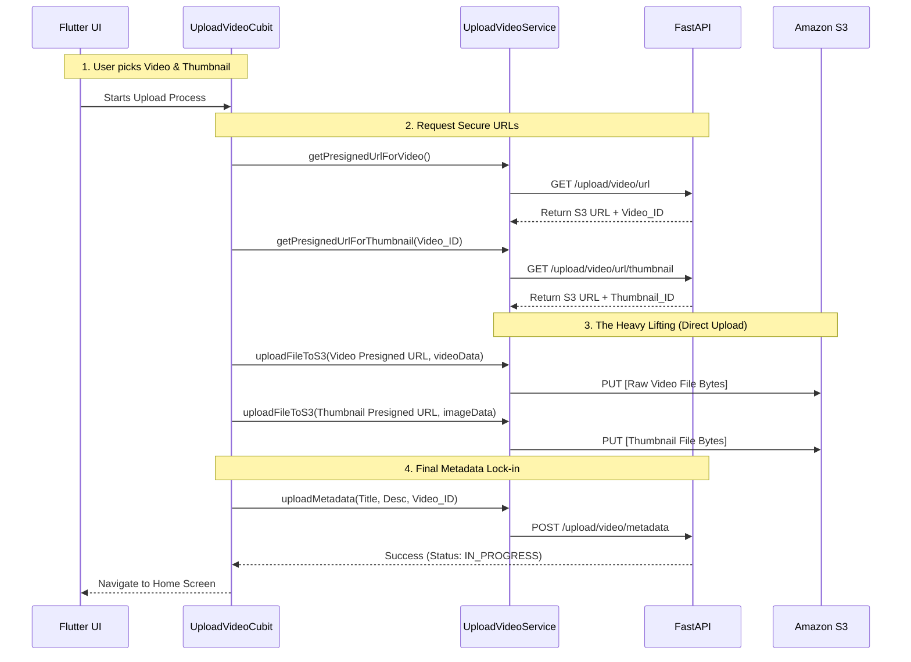

# Video Streaming App - Frontend (Flutter)

Welcome to the Frontend application of the Video Streaming App. This cross-platform mobile and web application is built using **Flutter**. It interfaces with the FastAPI backend to handle authentication, fetching video feeds, and implements a sophisticated direct-to-S3 video upload logic.

---

## 📂 Project Structure

This project follows a clean architecture pattern heavily utilizing **BLoC/Cubit** for state management.

```
video_streaming_app_frontend/
│
├── .env.example              # Placeholder for local environment variables
├── pubspec.yaml              # Project metadata & Dart dependencies
│
└── lib/                      # Main source code directory
    ├── cubits/               # State management (AuthCubit, UploadVideoCubit)
    ├── pages/                # UI Views (Login, Signup, Home, Upload)
    ├── services/             # API Connectors (UploadVideoService, AuthService)
    ├── utils/                # Helper functions (ImagePicker, Snackbars)
    └── main.dart             # Application entry point & Theme Configuration
```

---

## 🛠️ Packages Used

Here are the primary libraries powering this frontend:

*   **`flutter_bloc`**: Handles the global state of the application seamlessly (used for Authentication states and Upload progress states).
*   **`http`**: Manages the REST API calls to the FastAPI backend and `PUT` requests to Amazon S3.
*   **`flutter_secure_storage`**: Securely encrypts and stores the Cognito `access_token` on the user's device for persistent logins.
*   **`image_picker`**: Natively launches the device's gallery to allow the user to select video files and thumbnail images.
*   **`better_player`**: An advanced video player based on `video_player` that natively supports **HLS** and **DASH** adaptive bitrate streams (crucial for our transcoded output).
*   **`dotted_border`**: Used for UI styling on the upload screens.

---

## 🧩 Main Functions & Logic

The most critical flows live inside the `services/` and `cubits/` folders.

### `upload_video_service.dart`
This acts as the bridge for creating videos.
*   **`_getCookieHeader()`**: Reads the access token from secure storage to authorize backend requests.
*   **`getPresignedUrlForVideo()` / `getPresignedUrlForThumbnail()`**: Hits the FastAPI backend to generate temporary secure upload links for AWS S3.
*   **`uploadFileToS3()`**: Takes the raw bytes from the `File` and aggressively uploads them directly to the S3 bucket using an HTTP `PUT` request targeting the presigned url.
*   **`uploadMetadata()`**: Once both S3 uploads succeed, this officially registers the video details (Title, Description) in the Postgres database.

### `utils.dart`
*   Contains `pickVideo()` and `pickImage()` which abstract the `image_picker` logic to cleanly retrieve `File` instances from the OS gallery.

---

## 🔄 The S3 Upload Pipeline (Client Perspective)

To prevent the backend from bottlenecking on massive video uploads, the client orchestrates a multi-step direct upload.



---

## ⚖️ Architecture Decisions & Trade-offs

| Decision | Why we did it | Trade-off Made |
| :--- | :--- | :--- |
| **Direct-to-S3 Uploads** | Bypassing the FastAPI backend means the client uploads at maximum speed. The backend never has to buffer gigabytes of video into server RAM. | The Flutter app must coordinate 3 separate HTTP calls (Get URL -> Put to S3 -> Post Metadata) which makes the `UploadVideoCubit` state machine much more complex to handle failures mid-flight. |
| **`flutter_bloc` for State Management** | Uploading large videos takes time. BLoC allows us to effortlessly emit `UploadingState` -> `SuccessState` -> `ErrorState` without spaghetti code in the UI. | Boilerplate heavy. Takes more effort to set up than simple `setState()` mechanisms. |
| **`better_player` over native video_player** | Native `video_player` struggles with advanced format switching. `better_player` parses `.m3u8` HLS playlists natively and allows user quality-selection out of the box. | It’s a significantly heavier package and depends on older nested dependencies. |

---

## 🌩️ Amazon Services Utilized

*   **Amazon Cognito** (Implicit): The frontend securely stores the JWT tokens generated by Cognito to authenticate all backend routes.
*   **Amazon S3**: The frontend communicates via HTTPS `PUT` commands directly to S3's API endpoints utilizing presigned URLs generated securely by the backend.

---

## 🚀 Future Improvements for Scaling

1.  **Environment Variables**: The app leverages `flutter_dotenv` to securely load routing parameters such as `API_BASE_URL` from a `.env` file at runtime. This prevents hardcoded IP addresses from lingering in version control and makes testing completely local vs running on physical devices seamless.
2.  **Chunked Uploads for S3**: For massive videos (>5GB), the current basic `PUT` request will timeout or fail on spotty cellular networks. Implementing S3 **Multipart Uploads** locally in Dart would allow pausing, resuming, and retrying individual 5MB chunks.
3.  **Background Uploading**: Use `flutter_workmanager` or a native background execution package to allow the user to minimize the app while the video uploads to S3 in the background.
